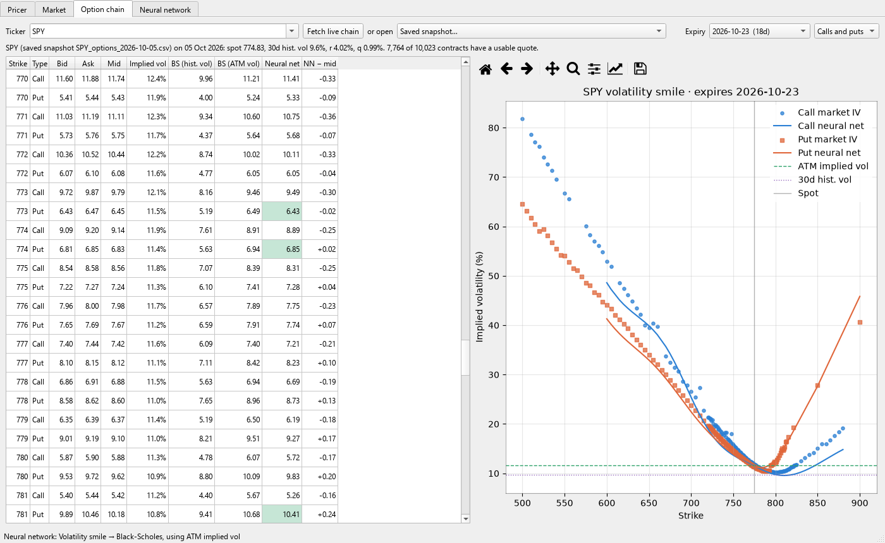
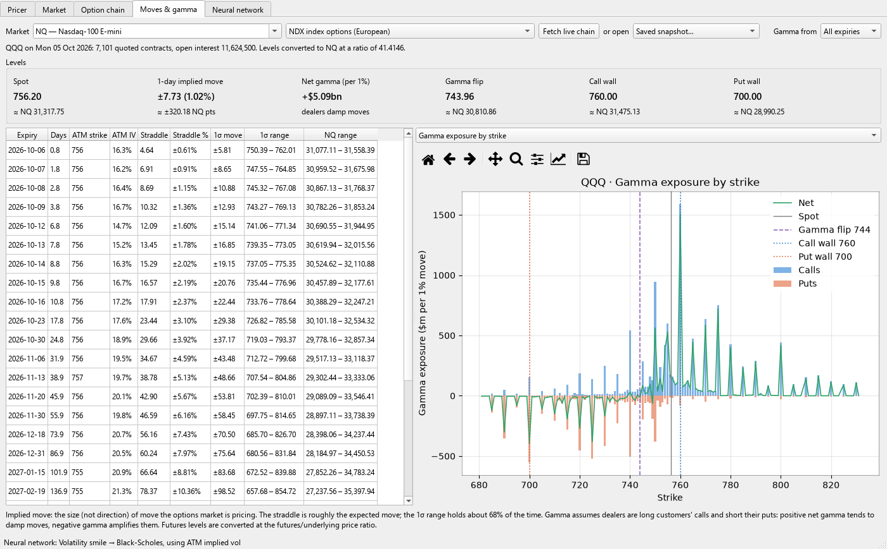
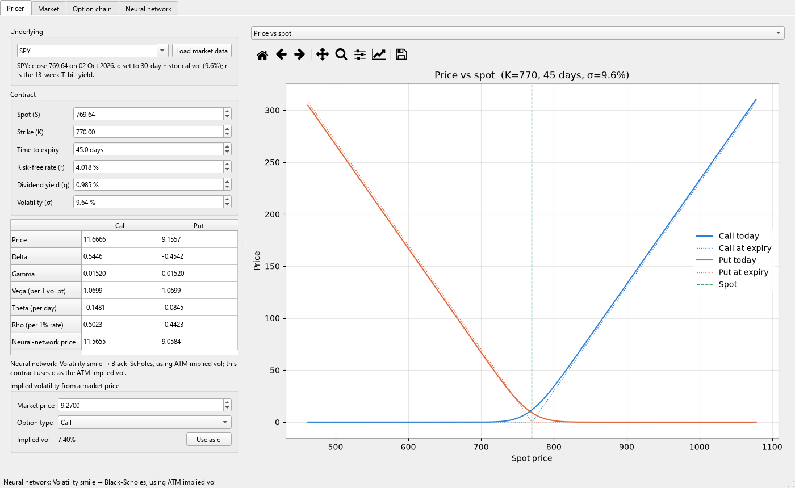
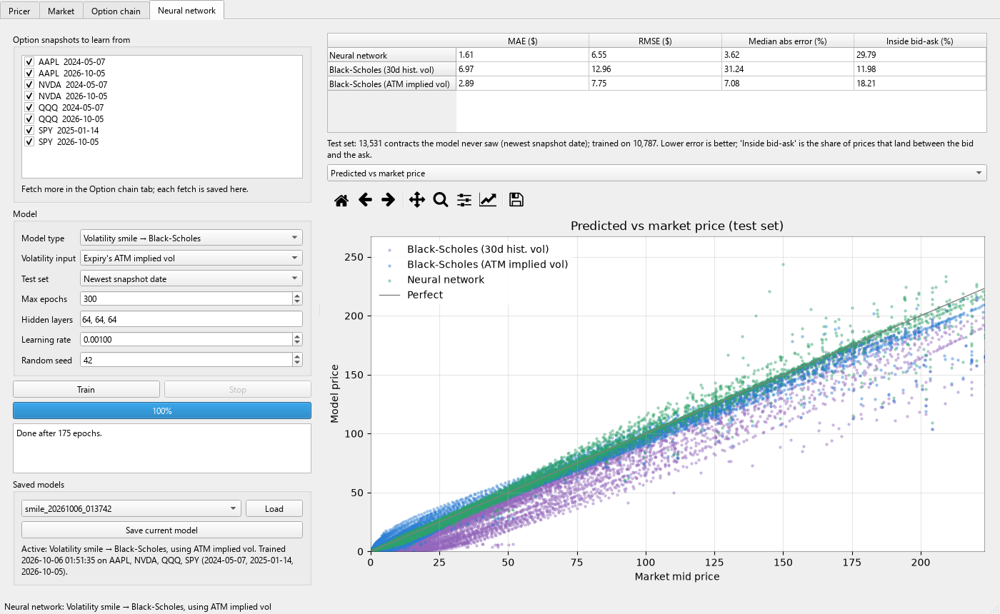

# Black-Scholes & Neural Networks

[](https://github.com/issyk0704/Black-Scholes-Neural-Networks/actions/workflows/ci.yml)

A desktop app and Python package for pricing options on index futures, FX, metals, Treasuries
and stocks, using Black-Scholes-family models and neural networks trained on real option chains.
It tests whether a network can price options more accurately than Black-Scholes.

Originally my final-year project; rebuilt in 2026 with corrected models, current data, futures and
FX markets, and a new interface.



## What it does

| Tab | |
|---|---|
| **Pricer** | Price and all five Greeks for any contract, updating as you type, under Black-Scholes-Merton (stocks, ETFs), Black-76 (futures) or Garman-Kohlhagen (FX). Loading a market fills in the price, the 13-week T-bill rate, the carry (dividend yield, or the foreign rate implied from FX futures) and 30-day historical volatility, and picks the right model. Includes an implied-volatility solver and charts of price and Greeks against spot or volatility. |
| **Market** | Price or yield history with 50/200-day moving averages, 30/60-day realised volatility against the matching implied-vol index (VXN, VIX, VXD, GVZ, MOVE), and the distribution of daily moves. Yields are measured in basis points. |
| **Option chain** | Fetches every listed expiry from Yahoo Finance (an ETF proxy for futures and FX markets). Each contract is shown with its bid/ask, implied vol, the Black-Scholes price and the neural-network price, and network prices that land inside the bid-ask spread are highlighted. The chart shows the market's volatility smile against the network's. Every fetch is saved as a dated snapshot, so the training set grows over time. |
| **Moves & gamma** | Implied moves for every expiry (ATM straddle and one-standard-deviation range) and dealer gamma levels (net gamma, gamma flip, call wall, put wall) for SPX, NDX and RUT index options, their ETFs (SPY, QQQ, IWM, DIA) or any stock, with every level converted to the futures we trade (ES, NQ, RTY, YM). |
| **Neural network** | Trains on any set of saved snapshots, reports test-set accuracy against two Black-Scholes benchmarks, plots errors by asset class, moneyness and expiry, and saves or loads models. |

## Markets

The watchlist is defined in [`src/bsnn/instruments.py`](src/bsnn/instruments.py). Adding a market means adding one line there.

Yahoo Finance has prices for futures, FX and yields but **no option chains** for them. For training
data, each market uses the options of a listed ETF that tracks it (its "options proxy"). For index
futures the proxy's smile is almost the same as the real one (SPY and ES track the same index). For
bonds it is only indicative, because TLT and ZB have different durations.

| Market | Price data | Pricing model | Options proxy |
|---|---|---|---|
| NQ, ES, YM, RTY | NQ=F, ES=F, YM=F, RTY=F | Black-76 | QQQ, SPY, DIA, IWM |
| GC / XAUUSD, SI / XAGUSD | GC=F, SI=F (Yahoo has no spot metals feed) | Black-76 | GLD, SLV |
| ZB, ZT, ZN | ZB=F, ZT=F, ZN=F | Black-76 | TLT, SHY*, IEF |
| US02Y, US10Y, US30Y | FRED DGS2, ^TNX, ^TYX | (yields, not option underlyings) | SHY*, IEF, TLT |
| DXY | DX-Y.NYB (index, no DX futures) | Black-76 | UUP* |
| EU, GU | EURUSD=X, GBPUSD=X; foreign rate from 6E=F, 6B=F | Garman-Kohlhagen | FXE*, FXB* |

\* Thin proxies, with only a few expiries and strikes. Their results should be treated with caution.

US02Y comes from the Federal Reserve's FRED database instead of Yahoo. Yahoo's only 2-year
series (2YY=F) barely trades and shows stale prints that look like 30 bp daily moves. FRED's
figure is official but published one business day late.

### Implied moves and gamma levels



**Implied move** is the size of move the options market is pricing, not its direction. It is
read straight from the quotes for each expiry:

- **Straddle:** the at-the-money call plus put, roughly the expected absolute move.
- **One-standard-deviation (1σ) move:** spot × ATM implied vol × √(time). Price should stay inside
  this range about 68% of the time if returns were normally distributed. The straddle is about 0.8 of it.
- **One-day move:** the nearest expiry's ATM implied vol ÷ √252.

**Gamma levels** estimate how much dealers must buy or sell per 1% move to stay hedged, adding up
gamma × open interest across every strike. They rest on the common assumption that dealers hold the
calls customers sell and the puts customers buy, which isn't always true, so treat them as a guide:

- **Net gamma:** positive means dealers sell rallies and buy dips, damping moves. Negative means they
  chase moves, amplifying them.
- **Gamma flip:** the price at which net gamma changes sign.
- **Call wall / put wall:** the strikes with the most call or put gamma, which often act as resistance
  or support.

For NQ, ES and RTY the tab offers the cash-index options (NDX, SPX, RUT) as well as the ETFs. These
are where most index gamma sits, and they are European-style, which suits the models. Levels are
converted to futures points using the futures/underlying price ratio on the snapshot day. Open
interest is only published during and after the US session, so fetch chains after 14:30 UK.

### Posting the levels to Discord

`bsnn-levels` turns the newest saved snapshot from before today into one Discord card per market
(NQ from QQQ, ES from SPY, YM from DIA by default). Each card shows the gamma regime, the gamma flip,
call wall and put wall in futures points, and the one-day implied move as a range around the current
futures price. Open interest only updates once a day, so the previous session's data is the most
current there is before the open.

```powershell
.\.venv\Scripts\bsnn-levels.exe                        # print the message as JSON; nothing is sent
$env:DISCORD_WEBHOOK_URL = "<your webhook URL>"        # the channel's webhook (keep it secret)
.\.venv\Scripts\bsnn-levels.exe --post                 # send it
.\.venv\Scripts\bsnn-levels.exe --post --source index  # use NDX/SPX options instead of QQQ/SPY
```

`bsnn-levels --zero-dte` reads live chains instead and posts **0DTE** levels: gamma from today's
expiry only (or the nearest one, for markets with no expiry today), the implied move to the close,
and the busiest strikes by volume. These levels move with price and time left, but they rest on
the morning's open interest: positions opened today, and whether volume was buying or selling,
can't be seen in free data.

In the cloud, workflows in the private data repository post each weekday (New York time):
the previous session's levels at **09:15**, and 0DTE updates at **09:45, 10:45, 13:30 and
14:45**. They read the webhook URL from a GitHub Actions secret.

The **Moves & gamma** tab has the same 0DTE view ("Gamma from: 0DTE"), a volume-by-strike chart,
and a 15-minute auto-refresh during US hours.

### Daily data collection

Option quotes on Yahoo are only live during US trading hours (14:30–21:00 UK). `bsnn-collect`
saves a snapshot of every proxy's chain and of the SPX, NDX and RUT index chains. The app also
refuses to save a chain fetched outside those hours. It refuses to run outside the session and skips any chain
where fewer than half the contracts have a live quote, which catches holidays and stale data.
To run it every weekday at 19:30 UK, from the repository root in PowerShell:

```powershell
.\scripts\register-daily-collection.ps1                               # create the scheduled task
Get-Content .\data\collect.log -Tail 20                               # check what it collected
Unregister-ScheduledTask -TaskName "BSNN daily option snapshots"      # remove it again
```

**Collecting without the laptop.** The same collector can run on GitHub's servers each weekday
using GitHub Actions' free tier, in a separate private repository: Yahoo's terms don't allow
republishing its data, so it shouldn't go in this public one. Clone that repository to
`data\options\cloud` and the app picks its snapshots up automatically; a snapshot collected both
there and on the laptop is counted once. Fetch the latest with
`git -C .\data\options\cloud pull`.

The laptop task runs while you're logged on (a locked screen is fine), on battery or mains, and the app
doesn't need to be open. It doesn't wake a sleeping laptop: if the laptop is asleep at 19:30, the
task runs when it wakes, and saves only if the US market is still open (before about 20:55 UK). Collected snapshots are gzipped (about 2 MB a day) and kept out of git; only the
bundled seed snapshots (plain `.csv`) are committed.

<p>
  
  
</p>

## Results

There are 25,915 quoted contracts across SPY, QQQ, AAPL and NVDA from snapshots taken on
7 May 2024, 14 Jan 2025 and 5 Oct 2026. Every number below is on contracts the model never saw.
"Inside bid-ask" is the share of prices that land between the bid and the ask.

**Out of time: trained on 2024/2025, tested on all 13,531 contracts from 5 Oct 2026**

| Model | MAE ($) | RMSE ($) | Median abs error | Inside bid-ask |
|---|---:|---:|---:|---:|
| **Neural net: smile, ATM vol** | **1.61** | **6.55** | **3.6%** | **29.8%** |
| Neural net: smile, historical vol | 5.09 | 9.74 | 20.8% | 16.4% |
| Neural net: direct price, ATM vol | 10.11 | 15.73 | 74.5% | 2.9% |
| Neural net: direct price, historical vol | 6.94 | 12.04 | 31.8% | 6.3% |
| Black-Scholes, 30-day historical vol | 6.97 | 12.96 | 31.2% | 12.0% |
| Black-Scholes, ATM implied vol | 2.89 | 7.75 | 7.1% | 18.2% |

**Same days: 20% of expiries held out at random (4,794 test contracts)**

| Model | MAE ($) | RMSE ($) | Median abs error | Inside bid-ask |
|---|---:|---:|---:|---:|
| **Neural net: smile, ATM vol** | **0.66** | 3.33 | **1.9%** | **34.0%** |
| Neural net: smile, historical vol | 1.35 | 3.75 | 8.4% | 20.9% |
| Neural net: direct price, ATM vol | 0.95 | 3.33 | 3.8% | 18.9% |
| Neural net: direct price, historical vol | 1.07 | **3.19** | 5.3% | 16.9% |
| Black-Scholes, 30-day historical vol | 2.31 | 4.95 | 14.9% | 14.1% |
| Black-Scholes, ATM implied vol | 1.61 | 4.36 | 7.3% | 18.3% |

What this shows:

- **Black-Scholes with one volatility per expiry misses the smile.** Out-of-the-money puts trade at
  higher implied vols than at-the-money options. Learning that shape roughly halves the error
  against Black-Scholes using the same ATM vol, both on the same days and on a later date.
- **Networks that predict prices directly don't carry over to new market conditions.** They beat
  Black-Scholes on the days they were trained on, but in October 2026 SPY's historical vol (9.6%)
  was lower than in any training snapshot. With nothing similar to learn from, they did no better
  than Black-Scholes, or worse. Predicting the smile *relative to* a vol level avoids this.
- **Historical vol is a weak input on its own.** Options price in expected volatility, not past
  volatility, which is why every model using the expiry's ATM implied vol does better.

All numbers come from a single run with seed 42 (`bsnn-train --split date` and `bsnn-train`, adding
`--kind` and `--hist-vol` for the other rows). With other seeds, the network's figures and the
expiries chosen for the random split will change.

## How the models work

**Data.** Each snapshot is a full option chain from Yahoo Finance, saved with the inputs that applied
when it was taken: the share price, the 13-week T-bill yield, the trailing 12-month dividend yield and
30-day historical volatility. A contract is used only if it has a two-sided quote, a bid-ask spread
under 50% of the mid, a spot/strike ratio between 0.7 and 1.3, and between 1 and 730 days to expiry.
The model is trained to match the bid/ask mid.

**Implied volatility** is solved from each mid using the snapshot's own rate and dividend yield.
Yahoo's `impliedVolatility` column isn't used, because it assumes zero rates and dividends, which
pushes call vols up and put vols down by several points.

**Smile model (default).** For each contract, the network predicts log(implied vol / reference vol)
from the strike's distance from spot (as a ratio and scaled by vol and time), the time to expiry and
the option type. The reference is either the at-the-money implied vol of the same expiry or 30-day
historical vol. Black-Scholes then converts the predicted vol into a price. Because only the
*shape* of the smile is learned, the model keeps working when the overall level of volatility changes.

**Direct price model.** The network maps scale-free features (log moneyness, time, rate, dividend yield,
historical vol, option type, and optionally ATM vol) straight to price / strike. It fits the days it
was trained on, but its inputs barely vary within a snapshot. On a new day with lower volatility than
anything it has seen, it has to extrapolate and does badly. It's kept as a baseline.

**Network.** 3 × 64 SiLU layers with input normalisation built into the model, Adam, mean-squared error,
learning-rate halving on plateaus, and early stopping on a validation set of held-out expiries.
Train/test splits never put one expiry in both sets.

## Getting started

Python 3.10 or later.

```bash
git clone https://github.com/issyk0704/Black-Scholes-Neural-Networks.git
cd Black-Scholes-Neural-Networks
python -m venv .venv
.venv\Scripts\activate          # macOS/Linux: source .venv/bin/activate
pip install -e ".[dev]"

bsnn                            # launch the app (or: python -m bsnn)
```

To get going:

1. **Neural network** tab: press **Train** (about a minute on a laptop CPU), then **Save current model**.
   The newest saved model loads automatically the next time you start the app.
2. **Option chain** tab: pick a ticker and press **Fetch live chain** to price today's quotes.
   Each fetch is saved to `data/options/` and becomes available for training.

Training from the command line, for repeatable experiments:

```bash
bsnn-train                              # smile model, ATM vol, random-expiry split
bsnn-train --split date --save          # train on older snapshots, test on the newest; keep the model
bsnn-train --kind price --hist-vol      # the direct-price baseline
bsnn-train --asset-class                # tell the network each contract's asset class
bsnn-train --help
```

With snapshots from more than one asset class, `bsnn-train` also prints the results for each class.
The `--asset-class` option is off by default. On the equity-only data available in October 2026 it
made results slightly worse (average error $1.87 against $1.61), but it should be re-tested once the
collector has gathered metals and bond chains.

Run the tests with `pytest`. The GUI tests need a display, or `QT_QPA_PLATFORM=offscreen`.

## Project layout

```
src/bsnn/
  instruments.py   the watchlist: price source, pricing model and options proxy per market
  pricing.py       Black-Scholes-Merton, Black-76, Garman-Kohlhagen; Greeks, implied vol (vectorised NumPy)
  market_data.py   Yahoo Finance and FRED downloads, CSV cache, rates, dividends, realised vol
  features.py      option snapshots -> modelling dataset
  analytics.py     implied moves and dealer gamma levels
  model.py         smile and direct-price networks, splits, evaluation, save/load
  train_cli.py     bsnn-train
  collect_cli.py   bsnn-collect
  gui/             PyQt6 app: one module per tab, plus shared workers and plotting
data/
  stock/           2-year daily price history per ticker
  options/         option-chain snapshots: bundled seed set (.csv) and collected (.csv.gz, not in git)
tests/             pytest suite, including GUI tests via pytest-qt
scripts/           daily-collection scheduler and the screenshot generator for this README
```

## Limitations

- The neural-network models are European, but US equity and ETF options are American. Quotes whose mid
  breaks European no-arbitrage bounds (usually deep in-the-money puts with early-exercise value)
  are dropped.
- The bundled data is eight snapshots taken on three days. Results will be more reliable once more days
  are fetched, and the "newest snapshot date" split is the test to trust.
- The share price for the 2024/2025 snapshots was recovered from put-call parity, because the exact
  fetch time wasn't recorded. It agrees with that day's close to within 0.3%.
- Futures, FX and Treasury options are learned from ETF proxies, not from the contracts themselves.
  Training on real CME options (ES, NQ, ZN, 6E, …) needs a paid data feed such as Interactive Brokers
  or Databento.
- Yahoo's continuous futures prices (NQ=F etc.) aren't back-adjusted, so the jump between contracts
  on quarterly roll days counts as a real move and briefly lifts realised volatility.
- The DXY price is the index itself, standing in for DX futures.
- Yahoo Finance data is unofficial and can be delayed or incomplete. This is a research and learning
  tool, not trading advice.

## License

MIT. See [LICENSE](LICENSE).
